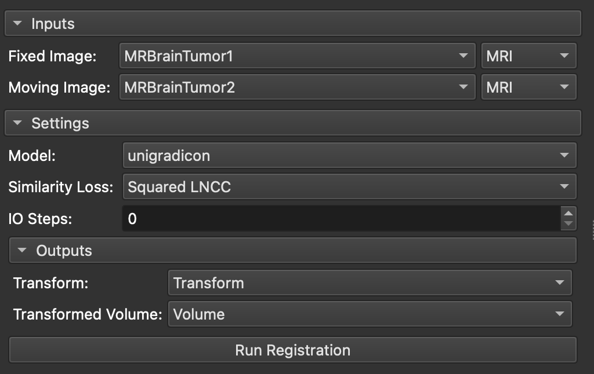

# SlicerUniGradICON

[](https://arxiv.org/abs/2403.05780) [](https://arxiv.org/abs/2408.00221) 

This is the official Slicer Extension for `uniGradICON`: A Foundation Model for Medical Image Registration, and `multiGradICON`: A Foundation Model for Multimodal Medical Image Registration. The extension provides a Slicer interface for the models, allowing users to perform image registration tasks using the models. The official repository for the models can be found [here](https://github.com/uncbiag/uniGradICON).

**uniGradICON: A Foundation Model for Medical Image Registration**  
Tian, Lin and Greer, Hastings and Kwitt, Roland and Vialard, Francois-Xavier and Estepar, Raul San Jose and Bouix, Sylvain and Rushmore, Richard and Niethammer, Marc  
_MICCAI 2024_ https://arxiv.org/abs/2403.05780  

**multiGradICON: A Foundation Model for Multimodal Medical Image Registration**  
Demir, Basar and Tian, Lin and Greer, Thomas Hastings and Kwitt, Roland and Vialard, Francois-Xavier and Estepar, Raul San Jose and Bouix, Sylvain and Rushmore, Richard Jarrett and Ebrahim, Ebrahim and Niethammer, Marc  
_MICCAI Workshop on Biomedical Image Registration (WBIR) 2024_ https://arxiv.org/abs/2408.00221  

Please (currently) cite as:
```
@article{tian2024unigradicon,
  title={uniGradICON: A Foundation Model for Medical Image Registration},
  author={Tian, Lin and Greer, Hastings and Kwitt, Roland and Vialard, Francois-Xavier and Estepar, Raul San Jose and Bouix, Sylvain and Rushmore, Richard and Niethammer, Marc},
  journal={arXiv preprint arXiv:2403.05780},
  year={2024}
}
```
```
@article{demir2024multigradicon,
  title={multiGradICON: A Foundation Model for Multimodal Medical Image Registration},
  author={Demir, Basar and Tian, Lin and Greer, Thomas Hastings and Kwitt, Roland and Vialard, Francois-Xavier and Estepar, Raul San Jose and Bouix, Sylvain and Rushmore, Richard Jarrett and Ebrahim, Ebrahim and Niethammer, Marc},
  journal={arXiv preprint arXiv:2408.00221},
  year={2024}
}
```

## Installation

This extension depends on Pytorch Slicer extension. If it is not installed, please install it from Extension Manager by simply searching for "Pytorch".

To install the uniGradICON extension, clone this repository using the following command:
```
git clone https://github.com/uncbiag/SlicerUniGradICON.git
```

Then, drag and drop the cloned repository folder into the Slicer window and click "OK" to install the extension. After the installation is done, the extension will appear under the Modules -> Registration menu.

## User Guide

<div style="text-align: center;">
    
</div>

1. Initially, select the fixed and moving images, and their modality (MR or CT/CBCT). The extension will preprocess the images based on the selected modality. The user does not need to perform any preprocessing steps manually.

2. The extension provides two models: `uniGradICON` and `multiGradICON`. Both models have the same interface and can be used to perform image registration tasks. The user can select the desired model from a drop-down menu.

3. Additionally, the user can specify the number of iterations for the instance optimization (IO steps) process. The default value is set to 0 iterations. However, we recommend using at least 50 iterations for more challenging registration tasks.

4. The user can also select the similarity loss function that will be used during the optimization process. The available similarity losses are:
    - Localized Normalized Cross-Correlation (LNCC)
    - Squared Localized Normalized Cross-Correlation (Squared LNCC)
    - Modality Independent Neighborhood Descriptor (MIND - SSC)
    
   For multimodal registration tasks, we recommend using the Squared LNCC or MIND - SSC similarity loss. Note that if IO steps are set to 0, the selected similarity loss function will not be applied.

5. The user can select the device that model will be run on. The available options are:
    - CPU
    - GPU (CUDA)
    
    If GPU is selected, the extension will use the GPU for the optimization process. Note that the GPU option is only available if the user has a CUDA-compatible GPU. Also, there are some limitations on the GPU memory usage. The peak memory usage of the model is as follows:

    - `w/o Instance Optimization`: 3364.0 MB
    - `w/ Instance Optimization using LNCC`: 11446.0 MB
    - `w/ Instance Optimization using Squared LNCC`: 11490.0 MB
    - `w/ Instance Optimization using MIND-SSC`: 14814.0 MB
  
    Please make sure that your GPU has enough memory to run the model. If the GPU memory is not sufficient, prefer using the CPU option.

6. Finally, the user can select the output transform and transformed image. These will be saved under the specified names in the Slicer scene.

7. After selecting all necessary parameters, the user can click the "Run Registration" button to initiate the registration process. The extension will perform the task using the selected model and parameters. Depending on the selected parameters and CUDA availability, the process may take a few minutes.

8. The user can visualize the registration results by selecting the output transform and transformed image under the "Data" module. Also, we recommend using the "CheckerBoard Filter" module to compare the registration result with the fixed image.

## TroubleShooting
Here are some common issues that may arise during the installation and use of the extension, along with their solutions:

- On first use, the extension downloads the required PyTorch libraries. This installation may take a few minutes, and it is normal for the Slice interface to appear frozen during this process. Please wait until the installation is complete. You can monitor the progress in the Slicer Python Console.

- The I/O process takes approximately one second per iteration on a GPU. Please be patient during the optimization process, particularly when using a CPU.
- If an error arises due to incompatibility between `setuptools` and `distutils`, update `setuptools` using the following command in the Slicer Python Console: `slicer.util.pip_install("setuptools -U")`

- **NumPy 2.x compatibility**: On Slicer 5.10+ (which ships with NumPy 2.x), PyTorch may fail to load with errors like `_ARRAY_API not found` or `Numpy is not available`. The extension will attempt to downgrade NumPy automatically when this is detected; if prompted, restart 3D Slicer for the change to take effect. You can also manually run `slicer.util.pip_install("numpy<2")` in the Slicer Python Console and then restart Slicer.

## Acknowledgements
This implementation is based on the [SlicerANTs](https://github.com/netstim/SlicerANTs) and [SlicerSegmentWithSAM](https://github.com/mazurowski-lab/SlicerSegmentWithSAM) repositories. We thank the authors for their work.